# Capstone Arcade
**Live link:** https://capstone-arcade-5a9455ce2843.herokuapp.com/

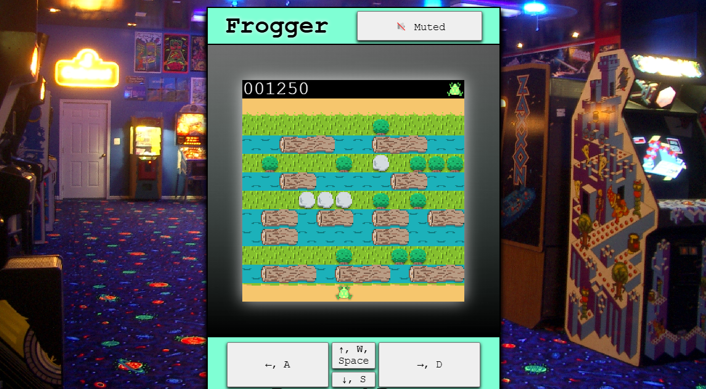

## Overview
Capstone Arcade attempts to use CSS Grid to arrange and display fully responsive replications of classic games, programmed in Javascript, within the theme of an old amusement arcade.

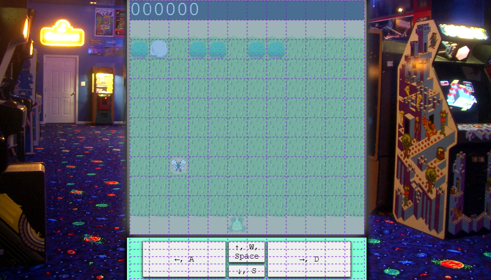

## Purpose
Visitors can interact with classic games adapted to a website in a way that preserves the feel of visiting an old-school, 80s amusement arcade.

## Target Audience
Recreational users. The websites core functions do not demand the registration of an account, so users can casually try their hand at Frogger and Snake, without needing to provide any personal information.

## Wireframes
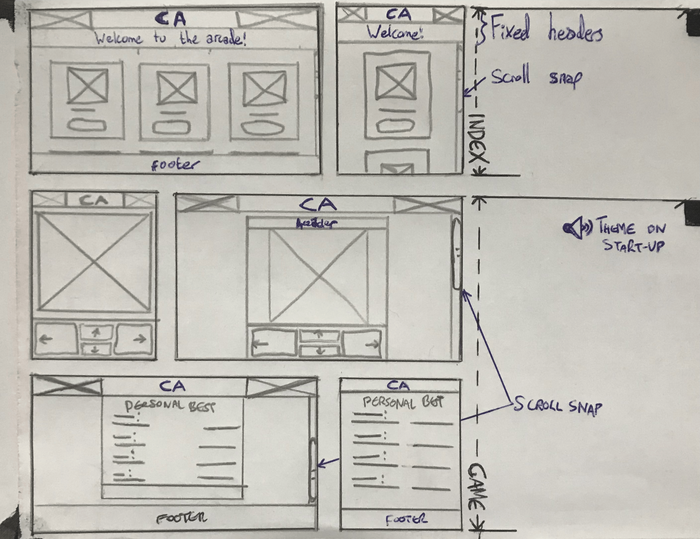

## Planning and Management
### Agile Development
**Project Board:** https://github.com/users/HerbieJames/projects/4

The features of this project were written as User stories, each explicitly outlining how the included feature would amount to an aspect of user experience. The features were categorised within a **M**o**SC**o**W** prioritization, where each was either a **M**ust Have, **S**hould Have, **C**ould Have, or **W**on't have.

### <span style="color: #0052cc;">Epic</span>
The epic constitutes a broader goal, to be accomplished upon the integration of several features from the User Stories.

**Simulate an arcade experience:** "As a user, I want to engage with features that remind me of being at an arcade, so that I can experience a simulation of that experience."

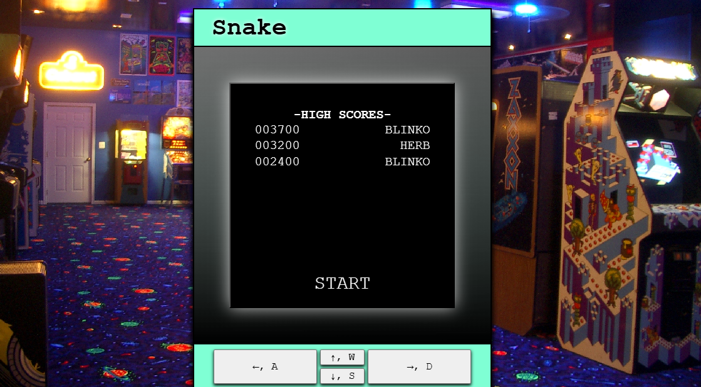
<div style="height:1em"></div>

### <span style="color: #BFDADC;">User Stories (Must Have)</span>
These features are essential for the project.

**View scores by game (Admin):** "As an admin, I want to view scores by game, so that I can understand how well users perform on each game more clearly."

**View scores:** "As a site user/admin, I can view scores on an individual game, so that I can see how well users have done."

**View list of games:** "As a user, I want to view a list of games, so that I can select which game to play."

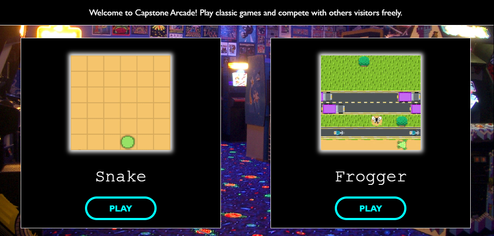
<div style="height:1em"></div>

**View a game machine:** "As a user, I can click on a game, so that I can see if I would want to play that."

**Leave a score on a game:** "As a user, I can leave leave scores on a game, so that I can compete with other players on the game."

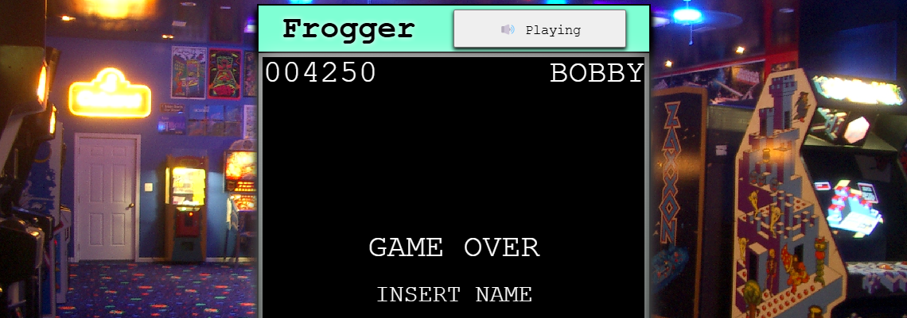
<div style="height:1em"></div>

**Account registration:** "As a site user, I can register an account, so that I can keep track of my scores, (earn tickets, and keep cosmetic rewards)."

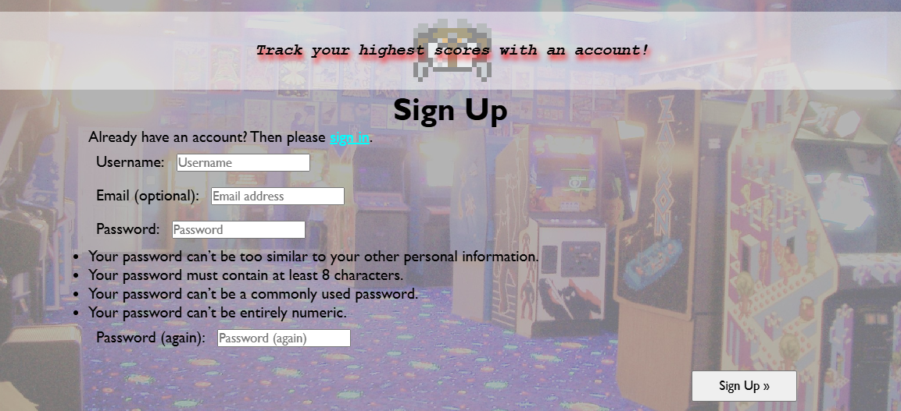
<div style="height:1em"></div>

### <span style="color: #C2E0C6;">User Stories (Should Have)</span>
These features would be prudent for the project.

**Delete scores (Admin):** "As a site admin, I can create, read, update and delete score, so that I can remove offensive aliases, or scores earn't through the use of a cheat, or cheats."

**View user hi-scores for each game beneath each game:** "As a user, I want to see all my placed scores for each game, so that I can view my progress."

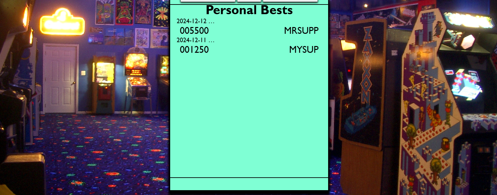
<div style="height:1em"></div>

**View user hi-score for each game in menu:** "As a user, I want to view my highest score for each game on the home page, so that I can see how good I am at different games."

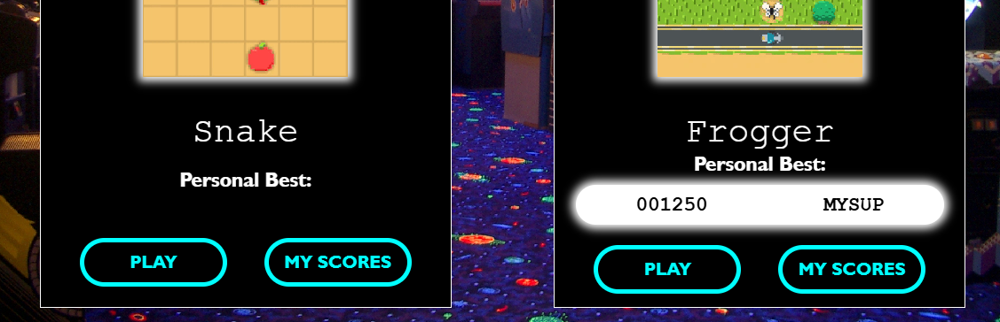
<div style="height:1em"></div>

### <span style="color: #FEF2C0;">User Stories (Could Have)</span>
These feature would improve the project if they were possible to develop.

**Hear audio responses upon changes within the game:** "As a user, I want to hear sound effects as I play through the games, so that I can intuit changes easier, and enjoy a higher degree of immersion."

<i style="color: rgb(255,128,128);">This feature did not land within the scope of this project's initial development timeframe, and was therefor not implemented.</i>

### <span style="color: #F9D0C4;">User Stories (Won't Have)</span>
This feature will not be in the final project

**Edit a score:** "As a user, I want to change the alias of one of my scores, so that I can fix mistakes I may have made on submission."

*This feature would have conflicted with the Epic "Simulate an arcade experience"*

**Modify or delete a score from a game:** "As a user, I can modify or delete my score on a game, so that I can changed the alias I assumed when I set that score, or remove the record of that score from the game."

*This feature would have conflicted with the Epic "Simulate an arcade experience"*

**Filter user scores by value or date:** "As a user, I want to filter my list of scores on a game page either by date or value, so that I can alternate between seeing my best ever performances, and seeing my progress."

<i style="color: rgb(255,128,128);">This feature did not land within the scope of this project's initial development timeframe, and was therefor not implemented.</i>

## Design
### Visual
Decisions such as Consolas for the font-face, liberal use of black, with thin white outlines and a neon aqua blue, were all made to curate an atmosphere reminiscent of a darkly lit amusment arcade, with pockets of space bursting with bright colours. I employed gifs to create a dynamic Home Page which, with the flashing lights, would also contribute to this.

### Sound
In producing the audio, several FX such as BitCrusher by Kilohearts were utilized to replicate an older format of digital audio. If given more time, I would love to go through these games and employ an array of sound effects for the player's and game's actions. This, I believe, would greatly elevate the responsiveness of the website.

### Game
**Snake:** Upon reaching an exceptionally high score in Snake, the level becomes staged, and is reset with the introduction of random walls which will kill the player if collided into. This was a creative way to reward the player for become almost too long to be avoidable anymore, and a way to keep the gameplay endless while not compromising on the experience of being able to grow unreasonable long.

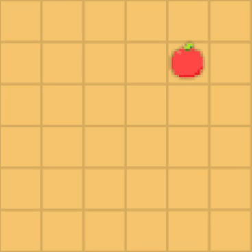
<div style="height:1em"></div>

**Frogger:** The first stage introduces the player to the controls in a non-lethal way, often generating a 1-up in the form of a fly. This makes the player feel comfortable and capable with the game. The second stage consists exclusively of grass and logs, while the third of grass and road. This introduces the player to each threat type seperately, allowing them to become familiar with the game's mechanics, and draws out these levels into a rich tutorial, complete with level 4 as the first introduction of both threat types together.

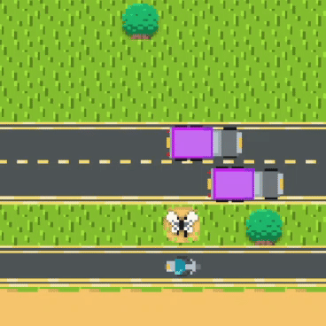
<div style="height:1em"></div>

**Beginner's Immunity:** In Snake, the player is unable to collide with themselves until they have consumed two apples and grown to a length of 5. Likewise, with Frogger, the player is unkillable until they have navigated the trivial obstacles and proceeded to the next stage. This simple consitency provides a degree of procedure before any score may be set on the site by any user.

### Interactivity
**Game Pad:** For the controls, each game accepts several options for keyboard inputs (i.e. WASD or Arrow Keys), but an array of buttons is also displayed for mobile use. Regardless of input type, the CSS will update on these displayed buttons. This adds another degree of interactivity for users when playing with the keyboard.

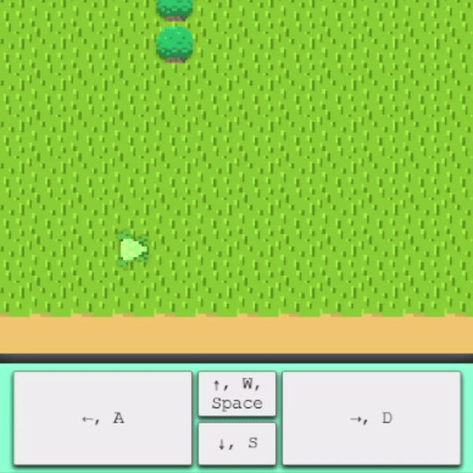
<div style="height:1em"></div>

### Back-end
**HTML:** Page breaks and DOM manipulation are employed to replicate the effects of using CSS grid for in any event of the styles not loading as they should do.

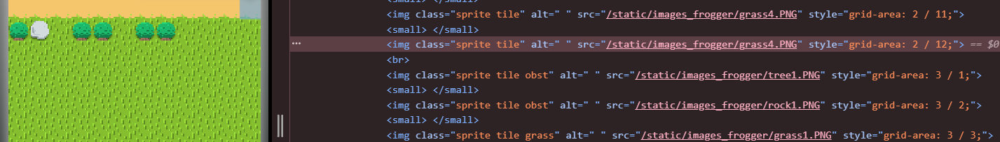

**Python:** A `ClearScore` method was written to routinely scrape the database of any erroneous game scores that would no longer need to be stored, such as low scores set by guest users of the arcade machines. This has made the project capable of recieving and storing scores from users without an account, which plays a vital role in the user experience.

## Models and Methods
### `Score` Model
Beyond the User model provided by Django, Score is the only other model utilized in this project. Here. the `player` foreign key is configure unconventionally for omission. An `alias` field is included to allow guest users to leave their mark on the machines. 

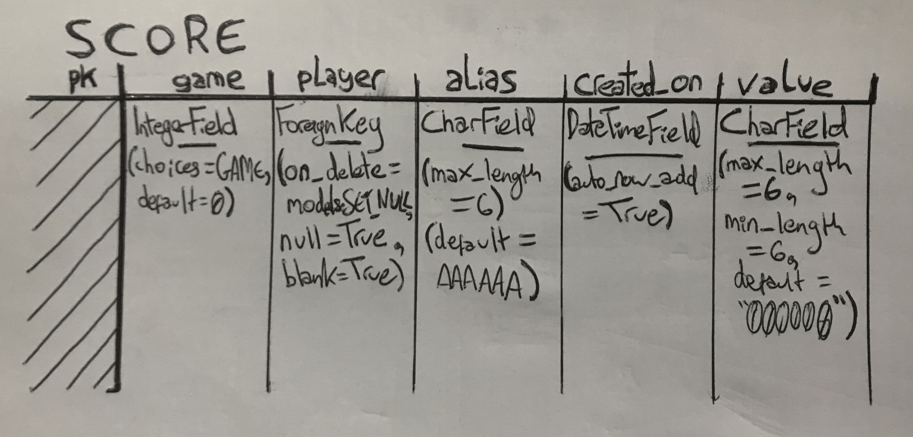

### `ClearScore` Method
In a seperate file titles methods.py, ClearScore is written to be called on submission of any new record, following the submission of said record. This method ensures no erroneous scores are written to the database, and removes and scores pre-existing scores which may have become erroneous by the inclusion of said new record. An erroneous score is categorised as any record which, among all records of any set game value and set player value (even null), falls outside of the top 7 highest scores in said queryset. It also deletes all scores of "000000" entirely from the database.
```
def clearScore(request, score):  # runs on any form submission - to remove redundant data
    for e in GAME:               # executes for each game
        gameIndex = e[0]
        if request.user.is_authenticated:  # target to remove user's worst (undisplayed) scores
            queryset = Score.objects.order_by("value").filter(player=request.user).filter(game=gameIndex)
        else:                              # target to remove worst (undisplayed) guest scores
            queryset = Score.objects.order_by("value").filter(player__isnull=True).filter(game=gameIndex)
        if queryset.count() - 7 > 0:
            all_but_top_seven = Score.objects.order_by("value")[:(queryset.count()-7)]
            for score in all_but_top_seven:
                score.delete()
    zero_scores = Score.objects.filter(value="000000")
    zero_scores.delete()
```

## Technologies
**8-Bit Painter and http://pixilart.com/draw:** This IOS and website (respectively) was chosen to create the artwork seen in the games. I opted for a very small resolution of 16x16 so that the sprites would not be challenging for me to create. These tools are designed for drawing at small resolutions.

**https://ezgif.com/:** This website was used to convert screen captures of gameplay into gifs that could be written into the site's homepage. It was simple to use and allowed for clipping and cropping also.

All of these tools made downloading the produced works straight-forward and painless.

**Reaper:** This DAW was chosen to record the theme and end-game audio for Frogger. These were small sections of retro themed music, featuring a ribbeting frog sound effect.

## Deployment
**Going Live (GitHub):** From the git repo, by navigating to `Settings -> Pages`, I selected to deploy from the root of the repo's main branch using `Source: "Deploy from a branch"`. This allowed me to test the html elements before they were configured in the Django framework.

**Going Live (Heroku):** From my dashboard, I used `New` to create the app. By navigating to `Settings -> Reveal Config Vars`, I set the URL of my database provided by Code institute. I then connected the repo to my app by navigating to `Deploy -> Connect to Git Repo`. I navigated to `Deploy Branch` and launched the app from the main branch. Finally, I added Heroku to `config -> settings.py -> ALLOWED_HOSTS` in my project.

## Testing Results
**Using Other Devices:** Through testing across several mobile devices, I discover the site's javascript components to be non-functioning for my phone, which pre-dates IOS 1.6 - I found this to be because DOM manipulation and many style changing Javascript methods are not compatible with older versions of browser like, for example, those installed on outdated operating systems.

**Google Chrome:** With the browser's Dev Tools, I have been able to assess the site's development across a complete range of viewport dimensions, and zoom settings. Furthermore, the tools open up individual element assessment, which has proven extremely important in this project, as so much of the javascript manipulates element positions in the DOM, and element styles.

**Django Debugging:** In using `config -> settings.py -> DEBUG = True ? False`, Django opens up an array of debugging tools with comprehensive error messaging with traceback. I used `DEBUG = TRUE` for creating the custom method `game -> methods.py -> clearScore`, and for configuring Django views, templates, models, forms and urls.`DEBUG` was set to `False` before every deployment.

**console.log (Javascript):** For complex inter-connected methods such as the ones used in frogger, robust use of console.log for displaying randomly generated data has been vital to configure the functions there, and for identifying where errors have occured. Crutially for this project, the ability to log a live node to the console has been exceptional.

## Validation
### HTML Validation (Git Hash: *f9803fcd5fbd0eb9c35227b32ba9dbdbbf7f1855*)
**"The element `label` must not appear as a descendant of the `a` element." (*base.html -> lines 27, 35, 39, and 42*):** This would require refactoring the label elements to something else. I chose span as another simple inline element.

**"An `img` element must have an `alt` attribute, except under certain conditions." (*index.html -> lines 23, and 54*):** This was an oversight. I chose the alt values of "snake preview" and "frogger preview" respectively.

**"Element `title` not allowed as child of element `header` in this context." (*snake.html -> line 12*):** This element was removed

**"Stray start/end tag `tr`**, **`td`**,**`th`" (*game.html -> lines 40, and 41*):** These table elements have been generated by Django with `{{ score_form }}` and ``. However, for each error indicating a "stray" openning tag by W3C, there is an associated error flagging the respective closing tag, also as "stray". So I have chosen to overlook this.

**" Attribute `name` not allowed on element `div` at this point. (*game.html -> line 56*)":** This attribute was added niavely to abide scroll snapping. It was removed at no effect to scroll snapping.

**"Heading cannot be a child of another heading."**, **"End tag `div` seen, but there were open elements."**, **"Unclosed element `h1`."** and **"Empty heading." (*frogger.html -> line 14*):** The `h1` element's closing tag lacked a backslash. This was ammended.

**"The `name` attribute on the `img` element is obsolete. Use the `id` attribute instead.":** This was a misconception of the accessibility principles, and was altogether removed.

**"End tag `p` implied, but there were open elements."** and **"No `p` element in scope but a `p` end tag seen." (*signup.html -> line 17*):** These `p` elements have been generated by Django with `` and `{{ form.as_p }}`. However, each error is the other's explicator.
*signup.html -> lines 25, and 26*

**"End tag `p` implied, but there were open elements."** and **"No `p` element in scope but a `p` end tag seen." (*signup.html -> lines 25, and 26*):** These `p` elements have been generated by Django with `` and `{{ form.as_p }}`. However, each error is the other's explicator. So I have chosen to overlook this.

**"Unclosed element `span`."** and **"Stray end tag `span`." (*signup.html -> lines 25, and 26*):** As with the previous errors, I have interpretted these errors in Django's generated html as non-issues.

### CSS Validation (Git Hash: *418a36df84b7f88c411c73d39c6c3650b426d75a* and *b9e052dc7958b17a7cf85d156c9db0ab0b339fd8*)
**"Value Error : padding-top `-12px` negative values are not allowed" (*indexStyles.css -> line 17*):** This was adjusted to `padding-bottom: 12px;`

**"Due to their dynamic nature, CSS variables are currently not statically checked":** Here, I ammended my declared variables in `:root { ... }` of styles.css to accountStyles.css, gameStyles.css, and indexStyles.css.

**"Property `container-type`**/**`container-name` doesn't exist"** and **"Unrecognized at-rule `@container`" (*gameStyles.css -> lines 67, and 68, 250, 276*):** Container queries and their use is outlined in w3's own documentation (https://www.w3.org/TR/css-contain-3/#container-queries). So I have chosen to overlook this.

## Dependencies:
**HTML Validator:** https://validator.w3.org

**CSS Validator:** https://jigsaw.w3.org/css-validator/

**Python Validator:** https://pep8ci.herokuapp.com/

**Background Image:** https://lunacityarcade.com/images/IMGP9846.JPG

All otherwise unmentioned art, sound, design and programming by Herbie James
